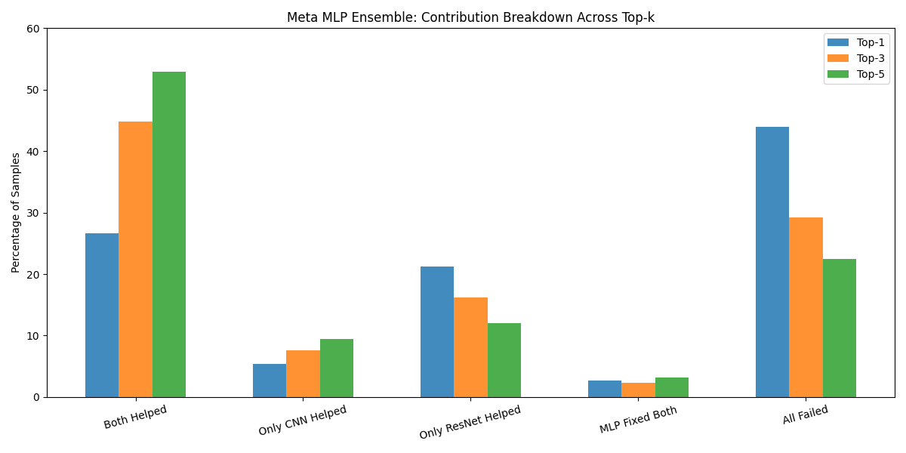

# Military Aircraft Image Classification

## Project Overview

The **Military Aircraft Image Classification** project explores and contrasts the performance of multiple deep learning architectures for the task of multi-class image classification. Using the Kaggle [Military Aircraft Detection Dataset](https://www.kaggle.com/datasets/a2015003713/militaryaircraftdetectiondataset), the goal is to classify images of military aircraft into 81 distinct classes using both custom-built and pre-trained image classification neural networks.

This project implements an ensemble approach using a **Meta MLP model** that combines predictions from base models, aiming to improve top-k classification accuracy and robustness.

This purpose of this project is to showcases the application of deep learning for real-world image classification and highlight the trade-offs between custom and 
pre-trained models while demonstrating how ensemble learning can improve performance and model reliability.

### Repository Structure

```bash
📂 Project Files:
├── Military_aircraft_classification.ipynb     → Main notebook with full codebase
├── create_pt_files.ipynb                      → Notebook containing the data loading and preprocessing
├── all_model_results.png                      → Combined loss and accuracy plots for all models
├── sample_images.png                          → Grid of sample aircraft images from the dataset
├── requirements.txt                           → Python library dependencies
📂 results/                                     → All model-specific results and evaluation plots
│   ├── 📂 Custom_CNN/
│   │    ├── classification_report.txt
│   │    ├── log_confusion_matrix.png
│   │    ├── top_k_accuracy_histogram.png
│   │    └── top_k_accuracy_table.csv
│   ├── 📂 Custom_ResNet_Like/                  → Same structure as above
│   ├── 📂 Pre-Trained_ResNet-18/               → Same structure as above
│   ├── 📂 meta_model/                          → Ensemble model results and analysis
│   └── model_comparison_results.csv           → Summary table comparing all models
```

## Data & Preprocessing

The data is derived from the [Military Aircraft Detection Dataset](https://www.kaggle.com/datasets/a2015003713/militaryaircraftdetectiondataset). From the dataset just the cropped dataset of 81 types of military aircraft are utilised. The dataset utilises the 34,515 RGB images with the following preprocessing applied:

- Stratified 70/15/15 train/val/test split to maintain class balance
- Applied data augmentation (`RandomHorizontalFlip`, `ColorJitter`) for training set
- All images resized to 224×224 and normalised to the calculated mean/std
- Converted images to tensors and saved each split as `.pt` files
- Loaded data using a custom `AircraftTensorDataset` and `DataLoader` with batching

## Key Methods

### **Custom CNN Model (`AircraftCNN`)**

A basic convolutional neural network architecture that uses 4 convolutional blocks to extract spatial patterns from aircraft images. While relatively lightweight, it learns hierarchical features but lacks the deeper connectivity and skip connections seen in more advanced architectures like ResNet.

- Stacked 2D convolutional layers grouped into **4 blocks** with increasing filter sizes (32 → 256)
- The first three blocks apply two convolutional layers with padding, followed by BatchNorm and ReLU, maintaining spatial dimensions.
- MaxPooling is applied at the end of each block to progressively reduce spatial resolution and increase receptive field
- The final block uses a **single convolution (256 channels)** followed by `BatchNorm`, `ReLU`, and **AdaptiveAvgPool2d** to compress feature map.
- output is **flattened** and passed through two fully connected layers with **ReLU** activations and **Dropout (p=0.5)** for regularization

### **Custom ResNet-Like Model (`CustomResNet`)**

A deeper convolutional neural network that follows the structure of the classic **ResNet-18 architecture**, this model uses **residual blocks** to allow for more efficient learning and improved performance compared to a plain CNN. The key idea is to **add shortcut (skip) connections** that let the model pass information directly across layers, helping to prevent the degradation of learning in deeper networks.

- Begins with a **stem block**: a `7x7` convolution with stride `2` followed by a `3x3` max pooling operation to quickly reduce spatial resolution from `224×224` to `56×56`, while increasing channel depth to 64.
- Includes **4 stages of residual layers** (`layer1` through `layer4`) with increasing channel depth:
  - Each stage consists of **2 residual blocks**.
  - Residual blocks contain two `3x3` convolutional layers with **batch normalization, ReLU**, and **dropout**, plus a **skip connection** that adds the input directly to the output.
  - When the spatial size or number of channels changes (e.g. from 64→128), a **projection shortcut** (1x1 convolution) is used to align dimensions for the residual connection.
- After all residual stages, a **global average pooling layer** compresses the feature map to `(B, 512, 1, 1)`.
- Ends with a **fully connected classifier**:
  - Flattens the output and passes it through a `Linear → ReLU → Dropout → Linear` sequence.
  - Final layer outputs logits for 81 military aircraft classes.

This architecture allows for **deeper feature extraction**, better gradient flow during training, and improved classification performance, particularly when compared to a plain CNN without residual connections.

### **Pre-Trained ResNet-18 Model (`AircraftResNet`)**

A transfer learning model built on the torchvision implementation of ResNet-18. As it is pretrained on ImageNet, this model can better leverage low-level and mid-level feature representations learned from millions of the general images. This significantly improves performance with minimal training on the aircraft dataset.

- Utilizes `torchvision.models.resnet18(pretrained=True)`
- The final FC layer is replaced with a new head:
  - `Linear → ReLU → Dropout(0.4) → Linear` to map to 81 aircraft classes

### **Meta MLP Ensemble Model (`EnsembleMLP`)**

The purpose of this model is to attempt to create a model that can approach the performance of the pre-trained model without the requirement of being pre-trained on the 1.1 million images in ImageNet. This model learns to combine the softmax outputs from both the CNN and ResNet models. It acts as a meta-learner, identifying patterns in prediction confidence to make more informed final classifications.

- Takes as input the **concatenated softmax outputs** from CNN and ResNet (size: 162 = 81 + 81)
- Architecture: `Linear → ReLU → Dropout → Linear` to output final logits
- Learns to dynamically **re-rank and reweight** class probabilities from both models
- Enhances performance by **capturing patterns** where one model is strong and the other fails

### **Training & Validation Loop**

Each model is trained using the same training loop structure as outlined below. Once trained the best performing model is saved for later use.

- Trained using `CrossEntropyLoss`, with optional **weights** to address imbalanced class distributions and reduce overfitting
- **Adam** optimiser with label smoothing and a `ReduceLROnPlateau` scheduler used to dynamically lower learning rate on validation plateau
- **Early stopping** after a configurable number of learning rate reductions to avoid overfitting
- Tracked and logged **training/validation accuracy and loss per epoch**
- 
## Evaluation Metrics

- **Classification Report**: Provides per-class precision, recall, and F1-score, with weighted averages to account for class imbalance.
- **Confusion Matrix Heatmap (Log Scale)**: Visualizes class-level prediction errors on a log scale to highlight both common and rare misclassifications.
- **Top-k Accuracy (Top-1, Top-3, Top-5)**: Measures how often the true label appears in the model’s top-k predictions, useful for evaluating performance in fine-grained classification.

## Results

The evaluation results for each model can be found in their respective folders within the /results/ directory. These include classification reports, log-scale confusion matrices, top-k accuracy histograms, and accuracy tables.

To compare model performance, we primarily focus on Top-k accuracy (Top-1, Top-3, and Top-5), as it provides a more complete picture of how well each model ranks the correct class, especially in the context of fine-grained aircraft classification.

### Model Performance

| Model                 | Top-1 (%) | Top-3 (%) | Top-5 (%) | Precision | Recall | F1-Score | Macro F1 | Support |
|-----------------------|-----------|-----------|-----------|-----------|--------|----------|----------|---------|
| Custom CNN            | 36.46     | 56.99     | 66.96     | 0.37      | 0.36   | 0.35     | 0.28     | 5178    |
| Custom ResNet Like    | 51.80     | 64.83     | 68.38     | 0.54      | 0.52   | 0.52     | 0.49     | 5178    |
| Pre-Trained ResNet-18 | 79.41     | 86.69     | 88.59     | 0.82      | 0.79   | 0.80     | 0.76     | 5178    |
| Meta MLP Model        | 55.99     | 70.76     | 77.54     | 0.58      | 0.56   | 0.55     | 0.50     | 5178    |

- **Custom CNN**: Achieved moderate performance (**36.46% Top-1**, **66.96% Top-5**) but struggled with class imbalance and fine-grained distinctions due to its shallow architecture.
- **Custom ResNet**: Improved overall accuracy (**51.80% Top-1**, **68.38% Top-5**) and class balance, benefiting from deeper layers and residual connections for better feature extraction.
- **Pre-trained ResNet-18**: Delivered the strongest results (**79.41% Top-1**, **88.59% Top-5**) by leveraging pretrained ImageNet features, offering robust performance and strong generalization across all classes.
- **Meta MLP Model**: Outperformed both custom models and narrowed the gap with the pre-trained model, achieving **55.99% Top-1** and **77.54% Top-5** accuracy by combining predictions from the CNN and ResNet through ensemble learning.

### Meta MLP Analysis
While the custom models demonstrated incremental improvements, neither was able to outperform the pre-trained ResNet-18 in isolation. However, the Meta MLP model—despite having a similar Top-1 accuracy to the custom ResNet—showed consistent improvements at Top-3 and Top-5 levels, indicating its strength in ranking the correct class higher even when not the top prediction.



This improvement is attributed to the MLP’s ability to leverage the complementary strengths of the CNN and ResNet. As seen in the contribution breakdown above, the ensemble often benefits from both models contributing jointly, and shows a tendency to favor the CNN more at higher top-k levels, possibly countering the ResNet’s tendency to be overconfident in its incorrect predictions.

Although the Meta MLP does not surpass the pre-trained ResNet in raw accuracy, its error profile at Top-5 is similar, making it a valuable ensemble strategy—especially in practical settings where top-k outputs are reviewed. It offers a flexible alternative where multiple candidate predictions can be considered for decision support. Overall the custom & MLP models performance is quite good considering the limited data that they were trained on. Training on a larger dataset would undoubtably result in a greater level of performance.

## **Dependencies**
Libraries required to run the notebooks are listed in `requirements.txt` and include:
```
numpy
pandas
matplotlib
seaborn
tqdm
Pillow
torch
torchvision
scikit-learn
```
